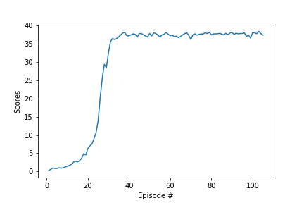

# REPORT 
---


## Learning Algorithm

The agent is trained with the [DDPG algorithm](https://arxiv.org/abs/1509.02971). The full algorithm is described in the METHODS section of the paper.

- initialize the replay memory `D` to some capacity `N`.
- initialize the local `Actor` and `Critic` neural networks. The actor network does the policy approximation while the critic does the value estimation.
- copy weights to the target `Actor` and target `Critic` networks after every iteration.
- train the agent for `x` episodes and for maximum number of time-steps (`max_t`) in each episode, unless it terminates earlier (e.g. by encountering a terminal state).

The training loop is composed out of two steps: `acti`ng and `learn`ing.
- In the `act`ing step, the agent passes the state vector through the `Actor` network and takes the action which is the output of the network.
- In the `learn`ing step, the `Critic` network is used as a feedback to the `Actor` network to change its weights such that the estimated value of the input state is maximized.

Next, we update the target Actor and Critic weights by making a copy of the current weights of the local Actor and Critic networks.

---

The algorithm uses two deep neural networks (actor-critic) with the following structure:
- Actor

```
Hidden: (input, 256) - ReLU
Hidden: (256, 128) - ReLU
Output: (128, output) - TanH
```

Where:
- input is the state space (33)
- output is the action space (4)

- Critic

```
Hidden: (input, 256) - ReLU
Hidden: (256 + action_size, 128) - ReLU
Output: (128, output) - Linear
```

Where:
- input is the state space (33)
- output is the Q-value (1)

- Hyperparameters
```
BUFFER_SIZE = int(1e5)  # replay buffer size
BATCH_SIZE = 128        # minibatch size
GAMMA = 0.99            # discount factor
TAU = 1e-3              # for soft update of target parameters
LR_ACTOR = 1e-4         # learning rate of the actor 
LR_CRITIC = 1e-4        # learning rate of the critic
WEIGHT_DECAY = 0        # L2 weight decay
```

Ornstein-Uhlenbeck noise parameters (0.15 theta and 0.2 sigma.)

## Plot of rewards
The agent is able to receive an average reward (over 100 episodes, and over all 20 agents) of at least +30.
Training was stopped after **104 episodes**, when the average over last 100 episodes reached more than +30.

In fact the training seems stable at around +39.5, and training for additional episodes, would yield this average.




## Ideas for Future Work

- [Proximal Policy Optimization (PPO)](https://arxiv.org/abs/1707.06347) and [Distributed Distributional Deterministic Policy Gradients (D4PG)](https://openreview.net/pdf?id=SyZipzbCb) methods could be explored to improve the performance of the agent.
- [Prioritized Experience Replay](https://arxiv.org/abs/1511.05952)
  - The idea behind using these technique for sampling from the replay buffer is that not all experiences are equal, 
   some are more relevant than others in terms of reward, and the agent should at least prioritize between the different experiences.